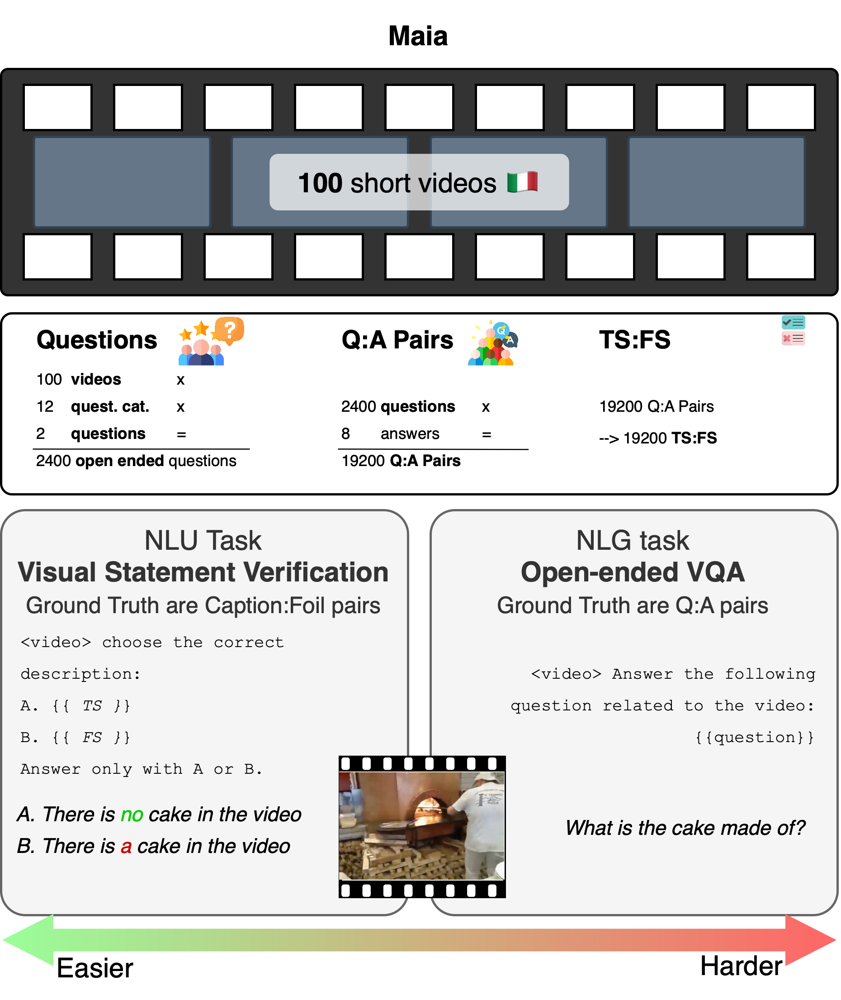

<h1 align="center">MAIA: Multimodal AI Assessment</h1>

<em>“Can AI truly understand what it sees – even in Italian?”</em>

Welcome to **MAIA**, the first Italian-native benchmark designed for evaluating **visual reasoning and grounding abilities** in VLMs.

  

---

## ✨ What is MAIA?  
 
- A **dataset** of carefully curated **video-based linguistic data**, fully in Italian.  
- A **suite of tasks** that challenge models not only to describe, but also to *reason, discriminate, and ground language in visual context*.
- An **evaluation tool** designed to bridge and compare two core abilities of VLMs:  
  1. **Understanding** (grounding visual input in language)
  2. **Generation** (producing coherent, context-aware output).
- A **framework** for assessing consistency and robusteness of VLMs within and across tasks
    

---

## 📦 What’s inside?  

- **Videos**: 100 short clips (~30 sec) providing rich multimodal context.  
- **Questions & Answers pairs**: 2,400 Italian questions, each with 8 human-provided answers (19,200 Answers).
- **True and False Statements pairs**: 19,200 True-False Statements pairs
- **Tasks**:  
  1. **Visual Statement Verification** *(Classification)* – models must distinguish between a correct caption and a minimally perturbed incorrect one.  
  2. **Open-ended Visual QA** *(Generation)* – models answer questions based on video content, with gold-standard human references.  

---

## 🚀 Why MAIA?  

Most benchmarks are:  
- **Task-oriented** (focused on performance in one predefined task).  
- **English-only**, overlooking linguistic diversity.  

MAIA is:  
- **Competence-oriented**, targeting *abilities* like abstraction, reasoning, and grounding.  
- **Italian-native**, ensuring linguistic and cultural authenticity.  
- **Video-based**, not just static images, capturing richer real-world scenarios.  

---
