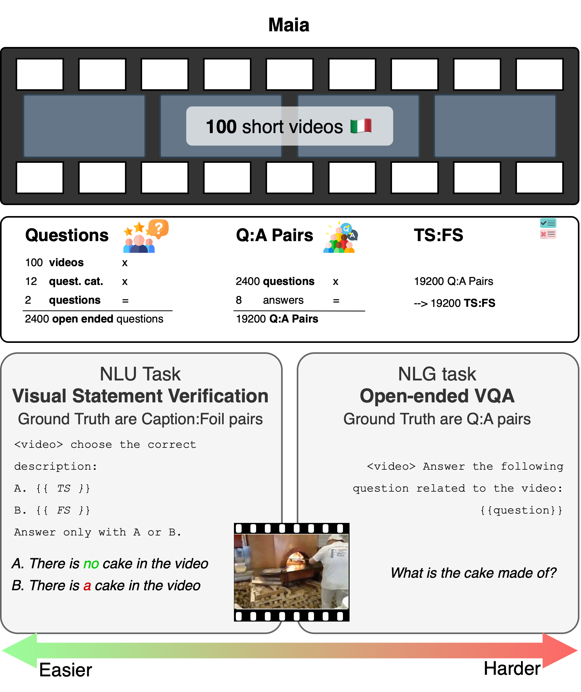

<h1 align="center">MAIA: Multimodal AI Assessment</h1>
<p align="center"><em>“Can AI truly understand what it sees – even in Italian?”</em></p>

Welcome to **MAIA**, the first Italian-native benchmark designed for evaluating **visual reasoning and grounding abilities** in VLMs.

<p align="center">
  
</p>


---

## ✨ What is MAIA?  
 
- A **dataset** of carefully curated **video-based linguistic data**, fully in Italian.  
- A **suite of tasks** that challenge models not only to describe, but also to *reason, discriminate, and ground language in visual context*.
- An **evaluation tool** designed to bridge and compare two core abilities of VLMs:  
  1. **Understanding** (grounding visual input in language)
  2. **Generation** (producing coherent, context-aware output).
- A **framework** for assessing consistency and robusteness of VLMs within and across tasks
    

---

## 📦 What’s inside?  

- **Videos**: 100 short clips (~30 sec) providing rich multimodal context.  
- **Questions & Answers pairs**: 2,400 Italian questions, each with 8 human-provided answers (19,200 Answers).
- **True and False Statements pairs**: 19,200 True-False Statements pairs
- **Tasks**:  
  1. **Visual Statement Verification** *(Classification)* – models must distinguish between a correct caption and a minimally perturbed incorrect one.  
  2. **Open-ended Visual QA** *(Generation)* – models answer questions based on video content, with gold-standard human references.  

---

## 🚀 Why MAIA?  

Most benchmarks are:  
- **Task-oriented** (focused on performance in one predefined task).  
- **English-only**, overlooking linguistic diversity.  

MAIA is:  
- **Competence-oriented**, targeting *abilities* like abstraction, reasoning, and grounding.  
- **Italian-native**, ensuring linguistic and cultural authenticity.  
- **Video-based**, not just static images, capturing richer real-world scenarios.  

---

## 🧠 Usage: Evaluating Models

The main entry point for running evaluations on the MAIA benchmark is the `eval_model.py` script.

### 🔧 Requirements

Make sure you have installed all dependencies:

```bash
pip install -r requirements.txt
```

### 🚀 Running an Evaluation

You can evaluate the supported Vision-Language Model (VLM) using:

```bash
python eval_model.py --model MODEL_NAME --dataset-config SPLIT-NAME ["gen","mc"]
```

example command to run InternVL on the generation task for all videos. --limit 50 to run on the first 50 samples for debug.  
```bash
python eval_model.py --model OpenGVLab/InternVL3-8B --videos-dir ./Videos --out-dir maia_gen_internvl3_answers --num-frames 12 --batch-size 4 --max-new-tokens 128 --limit 50 --dataset-config gen
```

example command to run InternVL on the generation task on a specific video like the black.mp4. --limit 50 to run on the first 50 samples for debug).
```bash
python eval_model.py --model OpenGVLab/InternVL3-8B --videos-dir ./black.mp4 --out-json maia_gen_internvl3_answers.json --num-frames 12 --batch-size 4 --max-new-tokens 128 --limit 50 --dataset-config gen
```

### 🧪 Evaluating MC predictions

After running the MC task with `eval_model.py`, you’ll have a JSONL file with one result per line.  
Use the scoring script to compute overall accuracy and per-category metrics:

```bash
python compute_mc_scores.py path/to/results.jsonl
```

### 🧪 Evaluating GEN predictions (standard)

After running the GEN task with `eval_model.py`, you’ll have a JSONL file with one result per line.  
Use the scoring script to compute the standard generative metrics (ROUGE, BertScore, BLEU etc.):

```bash
python compute_gen_scores_aggregated.py path/to/results.jsonl
```

### 🧪 Evaluating GEN predictions (LLM-as-a-judge)

Use the LLM-as-a-judge evaluation script to automatically score model generations with a large language model acting as the judge.

```bash
python compute_llm-as-a-judge.py path/to/results.jsonl --outdir path/to/output_dir --model-name MODEL_NAME
```

example command to run gpt-4o mini as a judge for evaluating results of a VLM on the generation task.

```bash
python compute_llm-as-a-judge.py vlm_results.jsonl --outdir llm_judge_out --model-name gpt-4o-mini

```

---

## 📚 Citation  

If you use **MAIA**, please cite the relevant work(s):  

### 📊 MAIA Dataset:

```bibtex
% MAIA Dataset
@inproceedings{testa-etal-2025-MAIA,
    title = "MAIA: A Benchmark for Multimodal AI Assessment",
    author = "Testa, Davide  and
      Bonetta, Giovanni  and
      Bernardi, Raffaella  and
      Bondielli, Alessandro and Lenci, Alessandro and Miaschi, Alessio and Passaro, Lucia and Magnini, Bernardo",
    editor = "Bosco, Cristina  and
      Ježek, Elisabetta  and
      Polignano, Marco  and
      Sanguinetti, Manuela",
    booktitle = "Proceedings of the 11th Italian Conference on Computational Linguistics (CLiC-it 2025)",
    month = sept,
    year = "2025",
    address = "Cagliari, Italy",
    publisher = "CEUR Workshop Proceedings",
}
```

### 🧪 MAIA Benchmark & Experiments:

```bibtex
% MAIA Benchmark

@inproceedings{
testa2025allinone,
title={All-in-one: Understanding and Generation in Multimodal Reasoning with the {MAIA} Benchmark},
author={Davide Testa and Giovanni Bonetta and Raffaella Bernardi and Alessandro Bondielli and Alessandro Lenci and Alessio Miaschi and Lucia Passaro and Bernardo Magnini},
booktitle={The 2025 Conference on Empirical Methods in Natural Language Processing},
year={2025},
url={https://openreview.net/forum?id=luhwjd4WVC}
}

```
